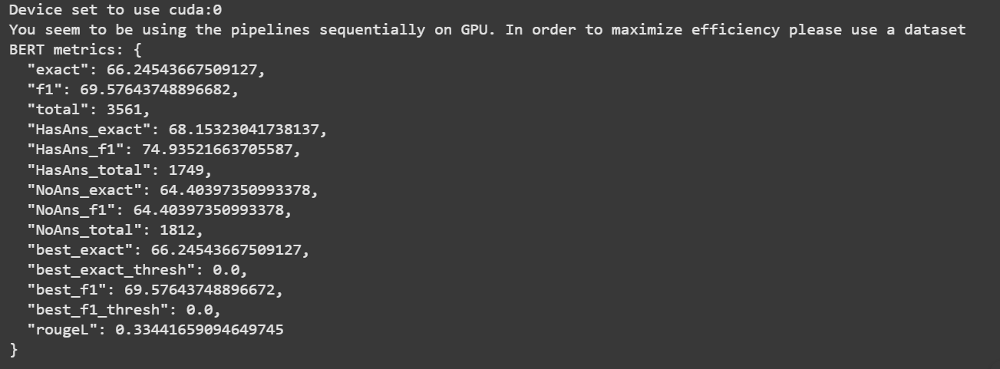
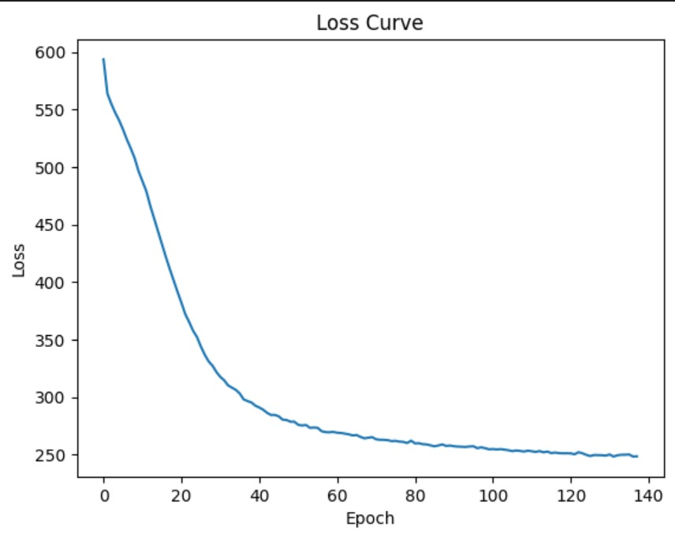
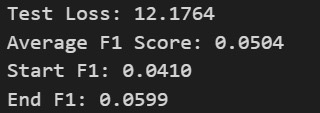
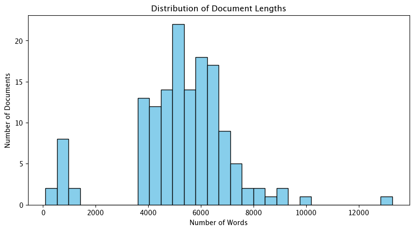
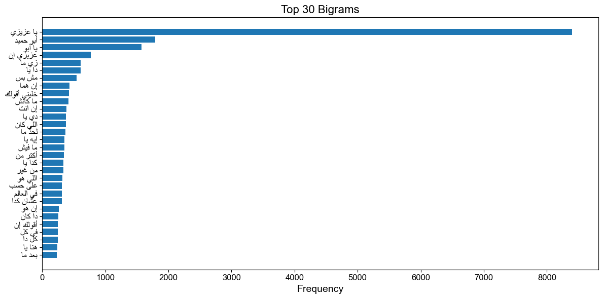
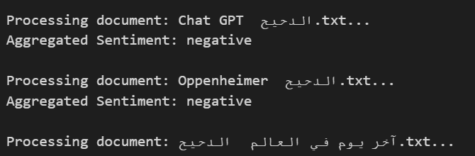
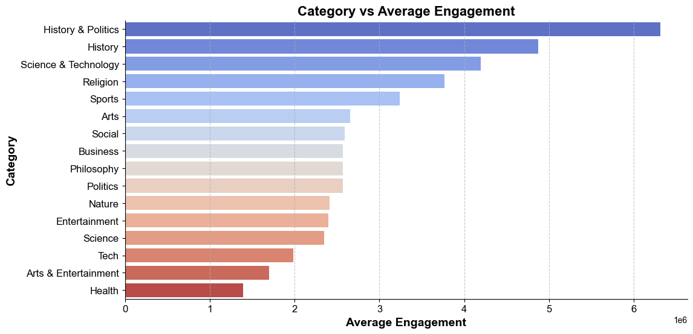
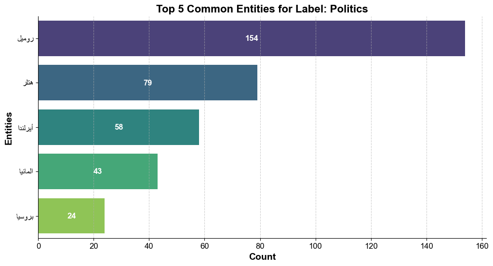
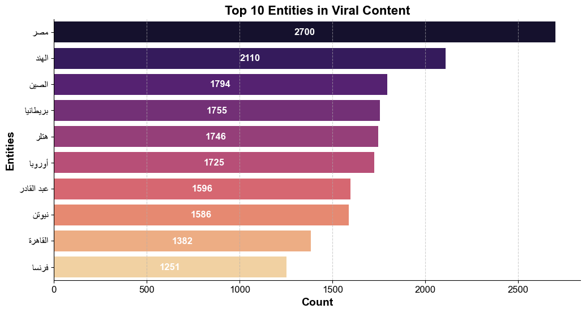
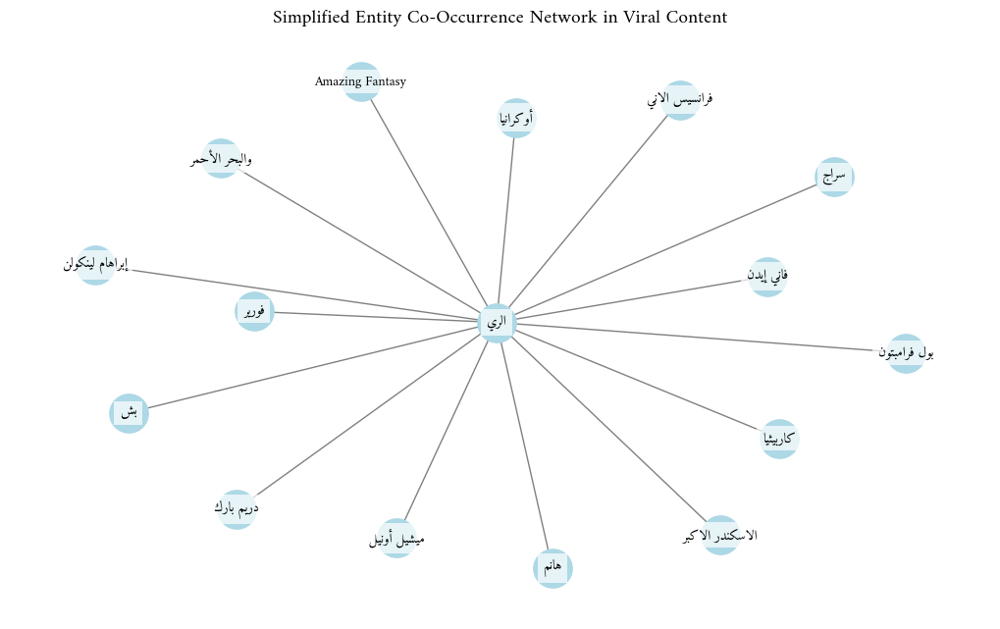

# Milestone 3 Report
## BERT on SQuADv2 for Question Answering + Chatbot
This project demonstrates comparison between (no fine-tuning) and fully fine-tuning a pre-trained BERT model on the SQuADv2 dataset for extractive question answering. It includes:

-  Dataset preparation  
-  Model fine-tuning  
-  Evaluation (EM, F1, ROUGE-L)  
-  A mini chatbot interface for QA
-  
https://colab.research.google.com/drive/1EcovG88xY-kIxG-j-LYf-oyobd5ye0P9?usp=sharing
## Experiment 1: BERT fine-tuning
We started by full fine-tuning of the bert-base-uncased model on the SQuADv2. Challenges included:

- Questions with answerable spans in the context
- Unanswerable questions that require the model to determine when no answer is present.

The task is extractive question answering, where the model is given a context and a question, and must return the span of text from the context that answers the question—or indicate that no answer exists.

### Results on Test Set 

Evaluation metrics on the SQuADv2 validation set (30% subset):

| Metric          | Score  |
| --------------- | ------ |
| **Exact Match** | 66.25% |
| **F1 Score**    | 69.57% |
| **ROUGE-L**     | 0.3344 |
| **HasAns F1**   | 74.93% |
| **NoAns Exact** | 64.40% |

https://colab.research.google.com/drive/1Ia-L9IiwNfABWzyoAafXZPXIezMZ5t9r?usp=sharing
## Zero-Shot BERT Evaluation (No Fine-Tuning)

In this experiment, we evaluated the pre-trained `bert-base-uncased` model directly on the SQuADv2 dataset **without fine-tuning**. The goal is to measure how well the base model performs in a real-world QA setting before any task-specific training.

---

### Setup

- **Model:** `bert-base-uncased`
- **Dataset:** SQuADv2 (30% subset of validation)
- **Training:**  *No training performed*
- **Evaluation Pipeline:** HuggingFace `pipeline("question-answering")`
- **Device:** CPU or GPU (based on availability)

---

### Results on Test Set 

| Metric            | Score     |
|-------------------|-----------|
| **Exact Match**   | 0.81%     |
| **F1 Score**      | 3.71%     |
| **ROUGE-L**       | 2.73%     |
| **HasAns Exact**  | 0.17%     |
| **HasAns F1**     | 6.06%     |
| **NoAns Exact**   | 1.43%     |
| **NoAns F1**      | 1.43%     |

> ### Limitations of Zero-Shot BERT (Without Fine-Tuning)

These results show that the base model, without fine-tuning, performs very poorly on the SQuADv2 dataset. This is expected, as the model has not been adapted to the QA task or trained to handle unanswerable questions.

---

### Why Fine-Tuning Improves Performance (Our Insight)

The pre-trained `bert-base-uncased` model has been trained on general language modeling tasks like **masked language modeling** and **next sentence prediction**, which capture general syntactic and semantic knowledge. However, it lacks the **task-specific supervision** required for span-based question answering in our case, especially for challenging datasets like SQuADv2.

Here are the core reasons fine-tuning is essential:

1. **Lack of Knowledge:**
   - BERT was not originally trained to predict **start and end token positions** that answer a specific question.
   - Fine-tuning introduces supervision that teaches the model to **map a question to a specific span** in the context.

2. **No Training for Unanswerability Detection:**
   - SQuADv2 includes questions that are **explicitly unanswerable**.
   - Only during fine-tuning does BERT learn to **predict "no answer"** confidently and differentiate between valid and invalid answer spans.

3. **Task-Specific Vocabulary and Attention Patterns:**
   - QA tasks require different attention patterns than general language modeling.
   - Fine-tuning helps the model specialize its internal representations to **focus on question-context interactions** more effectively.

4. **Fine-Tuning Adjusts All Parameters:**
   - Unlike zero-shot settings, full fine-tuning allows **all 110M parameters** of BERT to update, optimizing the model for the QA objective.
   - This makes it highly effective at capturing fine-grained dependencies between the question and context.

---

# Experiment 2: Retrieval-Augmented Chatbot on SQuAD

1. **Load & Prepare Data**  
   - Fetch SQuAD via `datasets`  
   - Sample/split into train/validation/test  
   - Deduplicate (and optionally chunks) contexts

2. **Build a FAISS Index**  
   - Embed contexts with `sentence-transformers/all-MiniLM-L6-v2`  
   - Wrap them in LangChain `Document`s  
   - Create a semantic retriever (top-k configurable)

3. **Configure FLAN-T5 QA Pipelines**  
   - Load `google/flan-t5-large` as a `text2text-generation` pipeline  
   - Define two prompts:  
     - **ZERO_PROMPT** (direct answer)  
     - **COT_PROMPT** (“First think step-by-step, then answer…”)

4. **Instantiates RAG Chains**  
   - `rag_zero` & `rag_cot` via `RetrievalQA.from_chain_type`

5. **Evaluates on Test Set**  
   - Runs both chains over held-out examples  
   - Computes SQuAD F1, ROUGE-L F1, BLEU (with text normalization)  
   - **Results**:  
     - **CoT** → F1 65.49 %, ROUGE-L 59.61 %, BLEU 45.73 %  
     - **Zero-shot** → F1 64.97 %, ROUGE-L 59.12 %, BLEU 48.82 %  
   - **Why so close?**  
     Both prompting strategies produce nearly identical token- and phrase-overlap on SQuAD with FLAN-T5-large—Chain-of-Thought gives only a marginal gain in F1/ROUGE, and zero-shot edges out on n-gram precision (BLEU).

6. **Provides a Chatbot Interface**  
   - `chat_cli(chain)`: simple REPL loop  
   - `ConversationalRetrievalChain` + `ConversationBufferMemory`: optional memory (sliding window or summary)

https://www.kaggle.com/code/malakamer/langchainlab

---

https://www.kaggle.com/code/mariammarioma/qa-attempt2/edit

# Milestone 2 Report

## Methodology

# Question Answering Model: LSTM-Based Encoder

This repository implements a question-answering (QA) system using an LSTM-based encoder model. The model predicts the start and end indices of the answer span within a given context, leveraging bidirectional LSTMs and cross-entropy loss for optimization.

---

## System Architecture and Pipeline

The system processes inputs such as questions and contexts, encodes them using bidirectional LSTMs, and outputs logits for start and end indices of the answer span. 

---

## Data Preprocessing Pipeline

To prepare the data for model training, several preprocessing steps were applied to the questions, contexts, and answers:

1. **Word-Based Answer Indexing**:
   - Replaced character-based answer indices with **word-based indices**.
   - Ignored punctuations, only counting words to compute `answer_start` and `answer_end`.

2. **Tokenization**:
   - Tokenized the input text into words.
   - Removed punctuation and non-essential characters.

3. **Lowercasing**:
   - Converted all words to lowercase for uniformity.

4. **Spell-Checking**:
   - Corrected spelling errors using a spell-checker tool to improve input quality.

5. **Word2Vec Embeddings**:
   - Ensured all words were present in the Word2Vec vocabulary & replaced all tokens in context and questions with their embeddings . 
   - Words not found in Word2Vec were assigned as tokens initially <UNK> token and then replaced with a random embedding.

6. **Padding Context & Questions**:
   - Added padding (zero vectors) to question embeddings shorter than maximum length defined (example: max_question_length was 33, therefore any question sample less than 33 in length was padded till it reached that length).
    - Chosen max length was based on max length in training samples, so we didn't need to truncate in this specific case.

7. **Output Labels**:
   - Added `answer_start` and `answer_end` as the word indices of the correct answer span in the context.

---

## System Components

### Key Components
1. **Input Embedding**:
   - **Embedding Dimension**: `300`
   - **Number of Hidden Layers**: `1`
   - Input sequences are padded and represented as tensors of word embeddings derived from Word2Vec.

2. **Bidirectional LSTMs**:
   - **Hidden Dimension**: `128 units`
   - **Number of Layers**: `1`
   - Separate LSTM layers are used for questions and contexts.
   - The bidirectional setup captures forward and backward context for richer representations.

3. **Fully Connected Output Layers**:
   - `start_fc` predicts the start index logits.
   - `end_fc` predicts the end index logits.
   - Logits are masked with `context_mask` to ignore padding tokens.

4. **Batch Size**:
   - `64`

---

## Pipeline Overview

### Inputs
1. **Questions**: Padded tensor of question embeddings, shaped `(batch_size, question_max_len, embedding_dim)`.
2. **Contexts**: Padded tensor of context embeddings, shaped `(batch_size, context_max_len, embedding_dim)`.
3. **Answer Start and End Indices**: Ground truth word-based indices, shaped `(batch_size,)`.
4. **Context Mask**: Binary mask to ignore padding tokens, shaped `(batch_size, context_max_len)`.

### Outputs
1. **Start Logits**: Predicted scores for the start index, shaped `(batch_size, context_max_len)`.
2. **End Logits**: Predicted scores for the end index, shaped `(batch_size, context_max_len)`.

---

## Training and Optimization

### Loss Function
- **Cross-Entropy Loss** is used to compute the difference between predicted and true start/end indices.
- Total loss: `start_loss + end_loss`.

### Optimizer
- **Adam Optimizer** with a learning rate of `0.001`.

### Early Stopping
- Stops training if no improvement in loss is observed for `6` consecutive epochs.

### Data Loader and Batching
- **Batch Size**: `64`
- Data is loaded using PyTorch's `DataLoader`, ensuring efficient mini-batch processing during training.

### 3. Hyperparameters

-   **Batch size**: 64
    
-   **Number of epochs**: 138
    
-   **Early stopping**: Halt training if the validation loss does not improve for `patience` epochs (e.g. patience = 6).
    
-   **Embedding dimension**: 300 (from Word2Vec)
    

### 4. Evaluation Metrics

On a held‑out test set, we compute:

-   **F1 Score**
    
    -   `start_f1`: F1 for predicted start indices
        
    -   `end_f1`: F1 for predicted end indices
        
    -   `avg_f1`: average of `start_f1` and `end_f1`
        
-   **Exact Match (EM)**
    
    -   Proportion of examples where both start _and_ end are predicted exactly correctly.
        
-   **Validation loss**
    
    -   Monitored each epoch to drive early stopping.
        

### 5. Monitoring & Visualization

-   We record per‑epoch training loss in `epoch_losses`.
    
---

## Model Evaluation

### Evaluation Metrics

The model is evaluated using the following metrics:
1. **Average Loss**: Average loss over the test set.
   
2. **F1 Score**:
   - **Start F1**: F1 score for start index prediction.
   - **End F1**: F1 score for end index prediction.
   - **Average F1**: Mean of Start F1 and End F1.
4. **Average F1 During Testing**: 5%

## Limitations

Despite successfully building a functional QA system, the model has several limitations. Most notably, it lacks any attention mechanism or deeper interaction between the question and context, meaning it fails to align the two inputs effectively. The context and question are encoded separately, and their representations are not jointly reasoned over, which significantly limits the model's ability to understand which parts of the context are relevant to the question. Additionally, the fixed input lengths (60 for context and 33 for questions) may truncate useful information or the actual answer span, especially in longer contexts. The absence of pre-trained transformer-based architectures, while intentional to satisfy milestone constraints, also restricts the model’s capacity to generalize complex patterns from the data. Lastly, errors in tokenization, spell correction, or alignment of answer indices—especially after cleaning—can introduce noise, further affecting accuracy.

# Milestone 1 Report

## Our Goal

For this milestone we decided to tailor the cleaning and pre-processing pipelines for a **topic modelling** task.

We started off by carrying out various analysis tasks to gain insight on how the data was originally formatted, its content, certain relationships and much more. We then used this analysis to guide our cleaning and pre-processing stages. The rest of this report will be talking about each stage we carried out, the reasoning behind each step and why we decided to do it that specific way.

## Data

For our project, we used data from the Da7ee7 YouTube channel. We acknowledge and credit Malak Labib and Hamza Gehad. for curating and providing access to this dataset. https://drive.google.com/drive/u/0/folders/10SnpI_Z6sxbAT1b1NXvL8Q7iLzEnJ0oO

## Analysis

### Document Length Distribution Analysis

- Method: We compute and visualize the number of words per document.
- Visualization: A histogram showing document length distribution.
- Reasoning: Ensures that most documents are sufficiently long for meaningful topic extraction. Detects outliers.

As we can see there are some outliers in the document lengths. Removing them before the machine learning task would be a good decision.

### Bigram Frequency Analysis

While unigram (single-word) analysis gives us insights into the most frequent words, bigram analysis reveals common word pairs, which can:

Capture phrases that provide richer topic meaning (e.g., "climate change" instead of "climate" and "change" separately).
Improve topic coherence, as certain concepts are better represented as pairs rather than single words.

Using these Bigrams as tokens would capture more meaning and contribute to a more efficient topic modeling pipeline.

### Word Frequency Analysis

- Method: Count occurrences of words across documents.
- Visualization: A word frequency histogram or a word cloud.
- Reasoning: Identifies most common words in the corpus. Helps determine if stopwords were effectively removed.

From this word cloud we gain insights on which words we can remove as stopwords and so on.

### TF-IDF Analysis

- Method: Compute TF-IDF scores to determine important words per document.
- Reasoning: High TF-IDF scores indicate document-specific importance. Helps visualize which words differentiate topics rather than just appear frequently.

### Sentiment Analysis

- Model: Ammar-alhaj-ali/arabic-MARBERT-sentiment model from Hugging Face's Transformers library. 
- Text Processing: Each document was processed in chunks of 150 words to handle long text effectively. Each chunk was classified into one of three categories: negative, neutral, or positive.
- Results Aggregation: Sentiment classification was aggregated for each document by calculating the average probabilities of all chunks and assigning the sentiment with the highest count as the final sentiment label.

#### Category vs. Average Engagement

- **Method:** We computed the average engagement (views, likes, and comments) per category.
- **Visualization:** Horizontal bar plot showing engagement levels for each category.
- **Reasoning:** Identifies which content categories drive the most audience interaction.

**Insight:**

- History & Politics had the **highest average engagement**, while Health had the lowest.
- Categories like **Science & Technology** and **Religion** also performed well, indicating public interest in these subjects.

#### **Most Common Entities for a Label (Example: Politics)**

- **Method:** Extracted the top entities appearing under the **Politics** label using NER.
- **Visualization:** Horizontal bar chart displaying the **top 5 most frequently mentioned entities**.
- **Reasoning:** Identifies the most commonly discussed names, places, or organizations within a category.

**Insight:**

- "روميل" (Rommel), "هتلر" (Hitler), and **major geopolitical regions** were dominant in political discussions.
- This suggests that historical political figures and past events are highly referenced in this category.

#### **Most Common Entities in Viral Content**

- **Method:** Identified the most frequently appearing named entities in **viral content (1M+ views).**
- **Visualization:** Bar chart ranking the top 10 most frequent entities.
- **Reasoning:** Helps determine **which topics contribute to virality**.

**Insight:**

- "مصر" (Egypt), "الهند" (India), and "الصين" (China) were among the most frequent entities in viral content.
- This suggests that **historical and geopolitical topics** play a strong role in engagement.

#### **Entity Co-Occurrence Network Analysis**

- **Method:** Created a network graph showing which entities frequently appear together in viral content.
- **Visualization:** A network graph of entity co-occurrence relationships.
- **Reasoning:** Helps identify potential thematic connections between entities.

**Insight:**

- The network did not reveal strong insights, as many entities appeared loosely connected rather than forming meaningful clusters.
- **Negative results are still valuable**, as they indicate that entity relationships in viral content may be more context-dependent rather than rigidly structured.

## Cleaning

For cleaning our data we:

- Remove the timestamps.
- Remove punctuations and numbers.
- Remove single letters.
- Remove repeated words.

The combination of these cleaning steps ensures that our dataset is free from unnecessary noise, improving the quality of the text data for further analysis. By removing timestamps, we eliminate nuances that may not be relevant to our task. Removing punctuation and numbers helps standardize the text, making it easier to process. Single letters, often artifacts of tokenization or errors, are removed to prevent misinterpretation. Lastly, eliminating repeated words reduces redundancy and overall helps by keeping the documents consistent.

These steps enhance the dataset's readability and usability, making it more suitable for our later processing stages.

## Pre-processing

### 1. Tokenization

- Method: We use RegexpTokenizer to split the text into individual words while preserving punctuation when necessary.

- Reasoning: Tokenization is an essential step before feature extraction. It allows us to work with individual cleaned words while preserving context. Regular expressions provide more flexibility compared to traditional whitespace-based tokenization.

### 2. Stopword Removal

- Method: We use a custom list of stopwords we generate from our analysis stage and remove those stopwords from the tokenized words.
- Resoning: Stopwords do not contribute to topic differentiation and by removing them we would be reducing the vocabulary size and improving topic separation. This will leave behind meaningful words that define topics, rather than generic fillers.

### 3. Stemming

- Method: We use the ISRIStemmer, which is optimized for Arabic text processing.

- Why Stemming and Not Lemmatization?
  Stemming reduces words to their root form by removing prefixes/suffixes (e.g., "كتابة" → "كتب").
  Lemmatization maps words to their dictionary base form (e.g., "better" → "good" in English).
  Lemmatization is often more precise, but it requires linguistic rules and a morphological analyzer.
  In Arabic NLP, stemming is preferred due to the complex nature of Arabic morphology. Lemmatization is computationally expensive and requires additional resources.
  Example:
  "مدرسة" (school) → "درس" (study/lesson) after stemming.

- Reasoning: This reduces dimensionality = reducing computational complexity. Moreover, the model will become more generalizable since word variants will now be mapped to the same word and the sparsity of data will be reduced.

### 4. TF-IDF

After cleaning, we need to convert text into numerical form for topic modeling.

- Method: We use TfidfVectorizer from sklearn to transform the text corpus into a TF-IDF matrix.

- Reasoning: Bag-of-Words (BoW) represents documents using raw word counts. However, frequent words dominate, reducing topic differentiation. TF-IDF (Term Frequency-Inverse Document Frequency) assigns lower weights to frequent words and higher weights to rare, meaningful words.

### 5. Named Entity Recognition (NER)

Although topic modeling focuses on general themes, Named Entity Recognition (NER) can provide additional insights.

- Method: We use a named entity recognition (NER) model to extract entities (e.g., names, organizations, locations).

- Reasoning: Certain named entities may be highly relevant to topics.

NER can help refine topic labels by identifying key figures, places, or institutions. Example Use Case: If an LDA model identifies a topic related to technology, NER can extract specific company names (e.g., "Apple", "Google"), making the topic labels more interpretable.

### Limitations of Our Framework

While our cleaning and preprocessing pipeline is well-optimized for topic modeling, there are certain limitations that should be acknowledged:

1. Sensitivity to Preprocessing Choices
   Certain preprocessing steps, such as stemming, may lead to loss of meaning for some words, affecting topic coherence.
   Stopword removal may unintentionally filter out words that hold contextual importance.
   Decisions like punctuation removal might impact phrase-based topic modeling approaches (e.g., bi-grams, tri-grams).
   Potential Improvement: A more dynamic approach where preprocessing choices are evaluated against topic coherence scores.

2. Loss of Context in Topic Modeling
   Bag-of-Words (BoW) and TF-IDF representations ignore word order, which may lead to loss of syntactic and semantic structure.

3. Most of the sentiment analysis results were classified as negative, which could indicate a limitation in the model's accuracy or bias in the dataset. The arabic-MARBERT model may not generalize well to specific contexts like this dataset's content. Further fine-tuning of the model might be necessary to improve accuracy.
